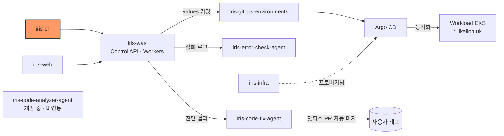
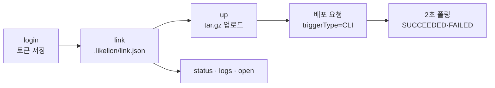

# iris-cli

Likelion CLI (`likelion`)

[](https://github.com/2026-softbank-1/iris-cli/releases)
[](https://github.com/2026-softbank-1/iris-cli/actions/workflows/ci.yml)


```bash
npm install -g https://github.com/2026-softbank-1/iris-cli/releases/download/v0.2.0/likelion-0.2.0.tgz
likelion login
likelion link && likelion up
```

<!-- TODO: likelion up 데모 GIF -->

## 시스템 내 위치

Likelion Control API([iris-was](https://github.com/2026-softbank-1/iris-was))를 터미널에서 부르는 클라이언트다. 같은 API 를 웹에서 쓰는 쪽은 [iris-web](https://github.com/2026-softbank-1/iris-web) 이다.



## 명령

| 명령 | 설명 | 상태 |
|---|---|---|
| `likelion login` | 브라우저에서 GitHub 로그인을 승인하면 토큰을 받아 저장한다 | 구현됨 ([계약](docs/login-contract.md), 운영 서버에서 확인) |
| `likelion whoami [--json]` | 로그인한 GitHub 계정을 보여 준다 | 구현됨 |
| `likelion logout` | 저장된 로그인 정보를 지운다 | 구현됨 |
| `likelion link [--project <id\|name>] [--service <id\|name>]` | 프로젝트·서비스를 골라 현재 폴더에 연결한다 | 구현됨 |
| `likelion status [--json]` | 연결된 서비스의 최근 배포 상태·단계별 소요 시간·주소를 보여 준다 | 구현됨 |
| `likelion logs [-f] [--since 1h] [-n 200] [--search <text>] [--target <id\|name>] [--json]` | 런타임 로그를 보여 주고 `-f` 면 새 로그를 계속 따라간다 | 구현됨 |
| `likelion logs --build\|--deploy\|--network [--deployment <id>] [-f] [--status-class 5xx]` | 배포 하나의 빌드·런타임·네트워크(ALB) 로그를 본다. `--build -f` 는 빌드가 끝날 때까지 따라간다 | 구현됨 ([운영 명령](docs/operations.md)) |
| `likelion open [--target <id\|name>] [--no-browser] [--json]` | 배포된 서비스 주소를 브라우저로 연다 | 구현됨 |
| `likelion up [--detach] [--logs] [--json]` | 연결된 폴더를 tar.gz 로 묶어 올려 배포하고, 끝날 때까지 상태를 보여 준다. `--logs` 면 빌드 로그도 보여 준다 | 구현됨 ([계약](docs/up-contract.md)), 운영 서버에서 `up` 한 번으로 배포 확인 |
| `likelion deployments [-n 20] [--json]` · `likelion deployments show [id]` | 배포 이력과 배포 하나의 상세(소스·빌드·단계·반영 결과)를 본다 | 구현됨 ([운영 명령](docs/operations.md)) |
| `likelion deploy [--sha <commit>]` · `redeploy [id]` · `rollback <id>` · `restart` (`--detach` `--logs` `--json`) | 대시보드의 Deploy·Redeploy·Rollback·Restart 와 같은 배포 요청을 만들고 끝날 때까지 기다린다 | 위와 같음 |
| `likelion env [--show-values]` · `env set KEY=VALUE…` · `env unset KEY…` · `env pull [file]` · `env push [file] [--yes]` | 서비스 환경변수를 보고(기본은 값 숨김) 바꾸고 `.env` 로 내려받거나 올린다(`push` 는 전체 교체) | 위와 같음 |
| `likelion diagnose [id] [--refresh] [--evidence]` | 실패한 배포의 AI 진단(원인·해결책)을 보여 주고, 없으면 시작해 끝날 때까지 기다린다 | 위와 같음 |
| `likelion fix [id] [--yes]` | 실패한 배포를 AI 가 고치게 한다(핫픽스 PR → main 머지 → 재배포) | 위와 같음 |
| `likelion setup agent [--print\|--global\|--dir <폴더>]` | 에이전트(Claude Code 등)가 이 CLI 를 쓰는 법을 담은 스킬 `SKILL.md` 를 설치한다 | 구현됨 ([에이전트](docs/agents.md)) |

## 설치

Node.js 20 이상이 필요하다. [Releases](https://github.com/2026-softbank-1/iris-cli/releases) 에 올라온 `likelion-<버전>.tgz` 를 설치한다(최신 v0.2.0). npm 에는 올리지 않는다(이름 `likelion` 을 다른 패키지가 쓰고 있다).

- 업데이트: 새 버전의 `.tgz` 주소로 위 설치 명령을 다시 실행한다.
- 삭제: `npm uninstall -g likelion`.
- 처음 쓰는 순서: `likelion login` → 배포할 폴더에서 `likelion link` → `likelion up`. 서비스는 대시보드에서 GitHub 레포를 연결해 먼저 만들어 둬야 한다.

## 동작



### 연결(`link`)

`link` 는 현재 폴더에 `.likelion/link.json` 을 만든다. 폴더 안 `.likelion/.gitignore` 가 `*` 라서 커밋되지 않는다. `status`·`logs`·`open`·`deployments`·`deploy` 등은 현재 폴더에서 위로 올라가며 이 파일을 찾는다. 로그인한 서버와 연결된 서버가 다르면 `link` 를 다시 하라고 안내한다. 대화형 터미널이 아니면(파이프·CI) `--project`·`--service` 를 지정해야 한다.

### 올리기(`up`)

- `.likelion` 이 있는 폴더를 통째로 올린다. 하위 폴더에서 실행해도 같다.
- `.git`·`node_modules`·`.likelion`·`.DS_Store`·`.env`(`.env.example` 은 포함)는 항상 뺀다. 루트의 `.gitignore`·`.likelionignore` 도 따르고, `.likelionignore` 에 `!.env` 처럼 적어 다시 넣을 수 있다. 하위 폴더의 `.gitignore` 는 읽지 않는다.
- 폴더 밖을 가리키는 심볼릭 링크는 빼고 알려 준다. 압축한 크기 한도는 250 MB 이고(서버 소스 스냅샷 한도와 같다), 넘으면 올리기 전에 멈춘다.
- 올린 뒤 `CLI` 배포 요청을 만들고 2초마다 상태를 확인해 `SUCCEEDED`·`FAILED` 등으로 끝날 때까지 보여 준다(최대 20분). `--detach` 면 요청만 보내고 끝낸다. 기본은 상태만 보이고 `--logs` 를 주면 빌드 로그도 이어서 보여 준다. 일시적인 서버 오류(5xx)·연결 끊김은 연속 5회까지 2~5초씩 늘려 가며 다시 확인하고, 넘으면 배포 번호와 `likelion status` 안내를 남기고 끝낸다. 4xx 는 다시 시도하지 않는다.

### 로그(`logs`)

`logs -f` 는 과거 로그를 먼저 보여 준 뒤 그 마지막 시각부터 SSE 로 이어 받는다. 서버가 5분마다 연결을 끊으므로 마지막 `id` 를 커서로 다시 연결하고, 겹쳐 오는 줄은 한 번만 찍는다. 서버가 `overflow`·`error` 이벤트를 보내면 다시 연결하지 않고 끝낸다. `--build`·`--deploy`·`--network` 는 배포 하나의 로그를 조회한다([운영 명령](docs/operations.md)).

## 설정

- API 주소: `login --api-url <url>` > 환경변수 `LIKELION_API_URL` > 기본값 `https://api.likelion.uk`. 로그인한 뒤에는 저장된 주소를 쓴다.
- 로그인 정보: `~/.config/likelion/credentials.json` (권한 `0600`). `XDG_CONFIG_HOME` 으로 위치를 바꾸고, 테스트에서는 `LIKELION_CONFIG_DIR` 로 덮어쓴다. 토큰은 로그·출력에 남기지 않는다.
- `LIKELION_TOKEN`: 저장된 로그인 대신 쓸 토큰(CI·에이전트). 서버 주소는 `LIKELION_API_URL` 이나 기본값이다.
- `LIKELION_NON_INTERACTIVE=1`: 터미널에서도 질문하지 않는다. `CI`·`CLAUDECODE`·`AI_AGENT`·`AGENT` 가 설정돼 있어도 같다. 확인이 필요한 명령은 `--yes` 를 요구한다.

## 에이전트에서 쓰기

LLM 에이전트가 쓰기 쉽게 `--json`(stdout 에 JSON 만, 진행 안내·오류는 stderr), 구분된 종료 코드(0 성공 · 1 실패 · 2 사용법 · 3 인증 · 4 결과 실패 · 5 일시적 오류), 질문 없는 실행, 스킬 파일을 갖췄다. `likelion setup agent` 로 스킬을 설치한다. 규약은 [docs/agents.md](docs/agents.md) 에 있다.

## 개발

Node.js 20 이상, TypeScript · commander · tsup · vitest 를 쓴다. CI(`.github/workflows/ci.yml`)는 PR·`main` push 마다 typecheck·test·build 를 돌리고 배포는 하지 않는다.

```bash
npm install
npm run dev -- whoami      # tsx 로 바로 실행
npm run typecheck
npm test
npm run build              # dist/index.js (실행 파일, shebang 포함)
```

## 문서

- [docs/development.md](docs/development.md) — 사용하는 API 표 · 릴리스 절차 · 코드 규칙
- [docs/operations.md](docs/operations.md) — 배포 이력·배포 요청·배포 로그·환경변수·AI 진단/수정 명령
- [docs/agents.md](docs/agents.md) — LLM 에이전트에서 쓰기: 스킬 설치 · 인증 · `--json` · 종료 코드
- [docs/login-contract.md](docs/login-contract.md) — `login` 서버 계약
- [docs/up-contract.md](docs/up-contract.md) — `up` 서버 계약
